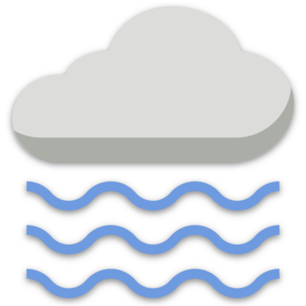

<h1 align="center">
  
  <br>
Weather Application - Get Daily Weather Information and Forecast
</h1>

<font size="3">
Using this application you can:

- Get current weather information and 5 days weather forecast of any city.
- Get weather information based on your location.

**_Take a look at the live version here:_** https://sukhjinderarora.com/weather-app/

# Technologies Used

This project is built using:

- HTML
- SCSS
- Vanilla JavaScript
- Webpack
- OpenWeather's REST API

# Development Workflow

### Steps to run this application locally:

1. Start by cloning the repository into your local file system.

   ```bash
   git clone https://github.com/SukhjinderArora/weather-app
   ```

2. CD in to the project directory

   ```bash
   cd weather-app
   ```

3. Open the repository in your favorite code editor.
4. Rename the `.env.example` to `.env` and set up all the environment variables mentioned in that file.
5. Finally run this command to start the application:

   ```bash
   npm start
   ```

   This command starts a local development server, opens application in your default browser, and watches for changes via livereload.

6. Optionally, you can use `npm run build` to build the production version of the application.

# Screenshots


# Responsive Design

This is web app is fully responsive to devices of all screen sizes. For example:


# Deploying To Github Pages

Use the command `npm run deploy` to deploy your application to Github Pages.

# Credits:

## This app uses :

- [Openweathermap](https://openweathermap.org/api) API to get the weather data.
